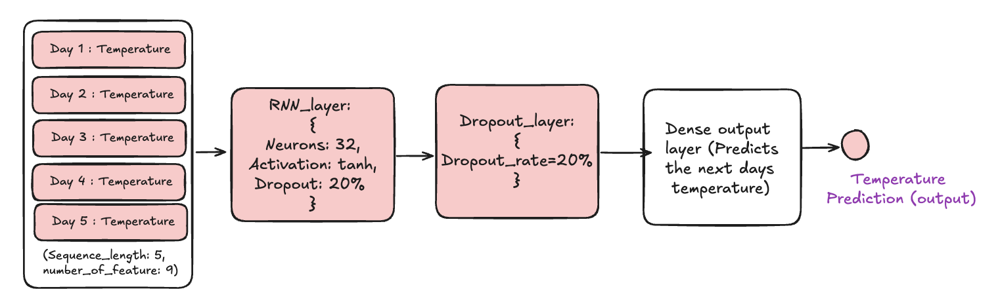

# Comparison between RNN, LSTM, and GRU

| Feature             | RNN                       | LSTM                      | GRU                        |
| ------------------- | ------------------------- | ------------------------- | -------------------------- |
| Architecture        | Simple recurrent layer    | Complex with memory cells | Simplified version of LSTM |
| Memory              | Short-term                | Long-term                 | Long-term                  |
| Gates               | None                      | Input, forget, output     | Update, reset              |
| Training Difficulty | Hard (vanishing gradient) | Easier (better gradient)  | Easier (fewer parameters)  |
| Use Cases           | Simple sequences          | Complex sequences         | Complex sequences          |

## 1. Simple RNN

**What is the model trying to do?**

The model predicts tomorrow's temperature based on the last 5 days of weather data (wind speed, humidity, precipitation, etc.).

### `1.1 Architecture Components`



1.1.1 **Input Layer**

- Shape: (5, 9)
    - 5: sequence length (5 days of history)
    - 9: number of features (wind speed, humidity, precipitation, etc.)

- What it does: Takes in the last 5 days of weather data.

1.1.2 **Simple RNN Layer**

- **32 hidden units** (neurons)
- **Activation:** `tanh` (squashes values between -1 and 1)

- What it does: 
    - Processes each day sequentially (Day 1 → Day 2 → Day 3 → Day 4 → Day 5)
    - Maintains a "memory" that carries information from previous days
    - Each day updates the hidden state based on current input + previous memory

1.1.3 **Dense Output Layer**

- **Rate**: 20% (0.2)
- **What it does**: Randomly "turns off" 20% of neurons during training to prevent overfitting

1.1.4 **Final Dense Layer**

- 1 **unit** with linear activation
- **What it does**: Takes the final hidden state and outputs a single number (predicted temperature)

### Memory

- The hidden state acts like short-term memory, remembering patterns from previous days

### `1.2 Output Comparison (Predicted vs Actual)`

- Predicted temperatiure (22.75 °C)

    

- Actual temperature (24.52 °C)
    

## 2. LSTM

**What is the model trying to do?**

The LSTM model predicts tomorrow's temperature based on the last 30 days of weather data (wind speed, humidity, precipitation, temperature, and engineered features like moving averages). Unlike Simple RNNs that struggle with longer sequences, LSTM can handle extended temporal dependencies making it more suitable for complex weather pattern recognition.

### `2.1 Architecture Components`


2.1.1 **Input Layer**
- Shape: (30, 9)
    - 30: sequence length (30 days of history - significantly longer than Simple RNN's 5 days)
    - 9: number of features (wind speed, specific humidity, relative humidity, precipitation, temperature, month, day of year, 3-day moving average, 7-day moving average)

- What it does: Receives 30 days of processed weather measurements with engineered temporal features
2.1.2 **LSTM Layer**
- **32 hidden units** (neurons)
- **Activation:** `tanh` (squashes values between -1 and 1)
- **Dropout:** 20% (prevents overfitting in recurrent connections)
- **Recurrent Dropout:** 20% (additional regularization for hidden state connections)   
- What it does: 
    - **Cell State Management:** Maintains long-term memory through cell state (C_t) that flows through time
    - **Gate Mechanisms:** Uses three gates to control information flow:
        - **Forget Gate:** Decides what information to discard from cell state
        - **Input Gate:** Determines what new information to store in cell state
        - **Output Gate:** Controls what parts of cell state to output as hidden state
    - **Sequential Processing:** Processes each day sequentially (Day 1 → Day 2 → ... → Day 30)
    - **Memory Preservation:** Unlike Simple RNN, can remember patterns from weeks ago without vanishing gradient issues
2.1.3 **Dropout Layer**
- **Rate:** 20% (0.2)
- **What it does:** Randomly "turns off" 20% of neurons during training to prevent overfitting and improve generalization
2.1.4 **Dense Output Layer**
- 1 **unit** with linear activation
- **What it does**: Takes the final LSTM hidden state and outputs a single number (predicted temperature in Celsius)

### How Data Flows Through the LSTM Model

```Input Sequence (30 days) → LSTM Processing → Output Prediction
Day 1: [features] ─┐
Day 2: [features] ─┤
       ...         ├─→ LSTM Gates ─→ Cell State Update ─→   Hidden State           
Day 29: [features] ─┤
Day 30: [features] ─┘------------------------------------↓
                                                    Dense Layer
                                                    (Prediction)
``` 


### `2.2 Gates in LSTM`

LSTM uses three gates to control information flow, making it much smarter than Simple RNN:

#### 2.2.1 **Forget Gate** 🗑️
- **Purpose**: Decides what information to throw away from previous memory
- **How it works**: 
  - Looks at previous hidden state and current input
  - Outputs values between 0 and 1
  - 0 = "completely forget this"
  - 1 = "completely keep this"
- **Weather Example**: Forgets yesterday's humidity if today's weather pattern is completely different

#### 2.2.2 **Input Gate** 📥
- **Purpose**: Decides what new information to store in memory
- **How it works**:
  - Has two parts:
    - **Sigmoid layer**: Decides which values to update (0 to 1)
    - **Tanh layer**: Creates new candidate values (-1 to 1)
  - Combines both to determine what new information to add
- **Weather Example**: Stores important new information like a sudden temperature drop or storm arrival

#### 2.2.3 **Output Gate** 📤
- **Purpose**: Decides what parts of memory to output as prediction
- **How it works**:
  - Looks at current input and previous hidden state
  - Filters the cell state to decide what to output
  - Creates the final hidden state
- **Weather Example**: Outputs relevant temperature patterns while filtering out noise from other weather variables

### `2.3 Why Gates Make LSTM Better`

| Simple RNN Problem | LSTM Solution |
|-------------------|---------------|
| Forgets old information quickly | **Forget Gate** selectively keeps important old info |
| Can't learn long patterns | **Cell State** maintains long-term memory |
| All information treated equally | **Input Gate** filters what's worth remembering |
| Poor control over output | **Output Gate** decides what to predict with |

**Real Weather Example:**
- Simple RNN might forget that 3 weeks ago was unusually hot
- LSTM's gates can remember: "3 weeks of heat → likely drought → higher temperatures ahead"

### `2.4 Output Comparison (Predicted vs Actual)`

- Predicted temperature (`23.45 °C`)

    

- Actual temperature (`24.52 °C`)

    

## 3. GRU 

**What is the model trying to do?**

The model predicts tomorrow's temperature based on the last 30 days of weather data (wind speed, humidity, precipitation, etc.) using a GRU (Gated Recurrent Unit) neural network.

### `3.1 Architecture Components`


3.1.1 **Input Layer**   
- Shape: (30, 9)
    - 30 = sequence length (30 days of history)
    - 9 = number of features (wind speed, humidity, temperature, etc.)
- What it does: Receives 30 days of weather measurements
3.1.2 **Simple GRU Layer**
- **32 hidden units** (neurons)
- **Activation:** `tanh` (squashes values between -1 and 1)
- **Dropout:** 20% (0.2) applied to inputs
- **Recurrent Dropout:** 20% (0.2) applied to recurrent connections
- What it does: 
    - Processes each day sequentially (Day 1 → Day 2 → Day 3 → ... → Day 30)
    - Maintains a "memory" that carries information from previous days
    - Uses **update gate** and **reset gate** to control information flow
    - Each day updates the hidden state based on current input + previous memory
3.1.3 **Dropout Layer**
- **Rate:** 20% (0.2)
- **What it does:** Randomly "turns off" 20% of neurons during  training to prevent overfitting
3.1.4 **Dense Output Layer**
- 1 **unit** with linear activation
- **What it does**: Takes the final hidden state and outputs a single number (predicted temperature)

### `3.2 Gates in GRU`

GRU uses two gates to control information flow, making it simpler than LSTM but still effective:
#### 3.2.1 **Update Gate**  
- **Purpose**: Decides how much of the previous memory to keep
- **How it works**: 
  - Looks at previous hidden state and current input
  - Outputs values between 0 and 1
  - 0 = "completely forget this"
  - 1 = "completely keep this"
- **Weather Example**: Keeps last week's temperature trend if it's still relevant 
#### 3.2.2 **Reset Gate**  
- **Purpose**: Decides how much of the previous memory to forget
- **How it works**:
  - Looks at previous hidden state and current input
  - Outputs values between 0 and 1
  - 0 = "completely forget this"
  - 1 = "completely keep this"
- **Weather Example**: Forgets last month's humidity if today's weather is completely different 

### 3.3 Why GRU is a Good Middle Ground
| Feature               | LSTM                          | GRU                           |
|----------------------|-------------------------------|-------------------------------|
| Complexity           | More complex (3 gates)        | Simpler (2 gates)                |
| Training Time        | Longer due to complexity       | Faster to train                |
| Performance          | Slightly better for very long sequences | Comparable performance for most tasks |
| Use Cases            | Very long sequences with complex patterns | Most sequence tasks with moderate length |     
**Real Weather Example:**
- LSTM might be overkill for 30 days of weather data
- GRU can capture necessary patterns with fewer parameters and faster training

### `3.4 Output Comparison (Predicted vs Actual)`

- Predicted temperature (`22.8 °C`)

    

- Actual temperature (`24.52 °C`)

    